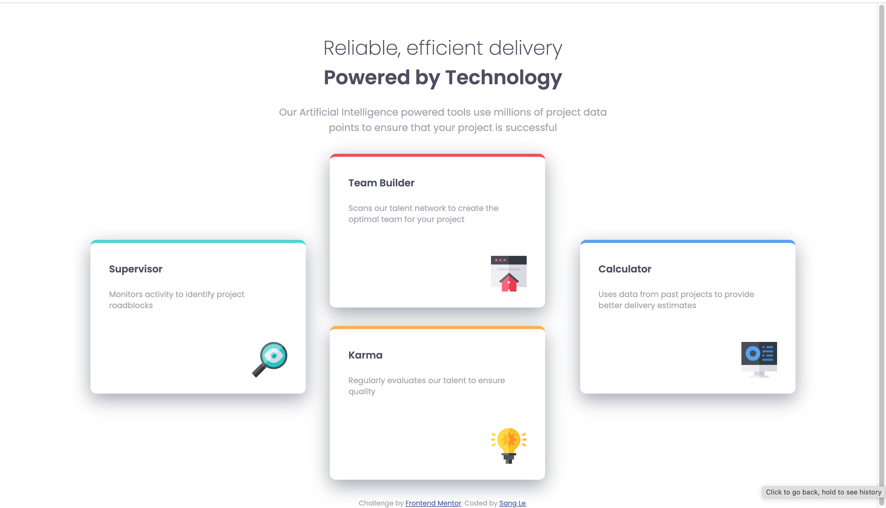

# Frontend Mentor - Four card feature section solution

This is a solution to the [Four card feature section challenge on Frontend Mentor](https://www.frontendmentor.io/challenges/four-card-feature-section-weK1eFYK). Frontend Mentor challenges help you improve your coding skills by building realistic projects. 

### The challenge

Users should be able to:

- View the optimal layout for the site depending on their device's screen size

### Screenshot

### Links

- Solution URL: [Here](https://github.com/sqle157/four-card-feature-section)
- Live Site URL: [Here](https://sqle157.github.io/four-card-feature-section)

### Built with

- Semantic HTML5 markup
- CSS custom properties
- Flexbox

## Author

- Website - [Sang Le](https://github.com/sqle157)
- Frontend Mentor - [@sqle157](https://www.frontendmentor.io/profile/sqle157)